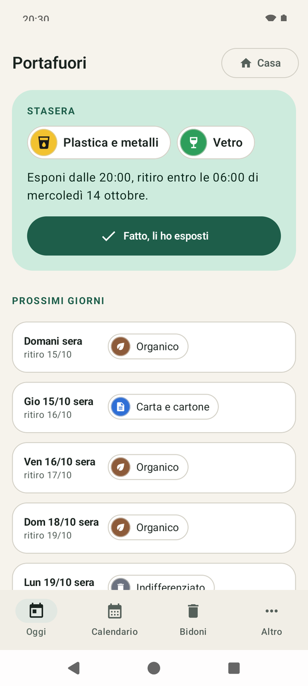

# Portafuori

**Ti ricorda la sera quali bidoni portare fuori.**

App Android gratuita per la raccolta differenziata porta a porta. Funziona senza Internet, senza account e senza pubblicità. Inserisci una volta il calendario del tuo comune, oppure lo importi da un vicino con un QR: ogni sera Portafuori ti avvisa quali bidoni esporre e fino a che ora.



## Scaricala

Vai su **[lorenzolubrano.github.io/portafuori](https://lorenzolubrano.github.io/portafuori/)**: c'è il pulsante per scaricarla e la spiegazione, passo per passo, di come installarla. Serve Android 8 o più recente.

## Cosa fa

- **Un avviso la sera prima,** uno solo con tutti i bidoni («Stasera: Plastica e metalli + Vetro»), all'ora che scegli, con i pulsanti «Fatto» e «Tra 30 min».
- **Le regole vere dei comuni:** ogni settimana, ogni due settimane, «1° e 3° martedì», «ultimo venerdì», date fisse, periodi dell'anno. Le festività italiane sono calcolate sul telefono, Pasqua compresa; il santo patrono lo aggiungi tu, e se un ritiro cade in un festivo l'app te lo chiede qualche giorno prima.
- **Il widget «Stasera»** per la schermata Home, con il pulsante «Fatto».
- **Il calendario passa al vicino** con un QR, un'immagine, un file o un codice da incollare in chat. Passano bidoni, giorni e festività, non i tuoi orari.

Ci sono anche più case (seconda casa, casa dei genitori), la pausa vacanza, il backup in un file e un controllo che ti aiuta a sistemare le impostazioni del telefono perché gli avvisi arrivino in orario.

## Privacy

- L'app non ha il permesso di usare Internet: i tuoi dati restano sul telefono.
- Niente account, niente pubblicità, niente statistiche.
- Il calendario lascia il telefono solo quando lo condividi tu.

## Sostieni Portafuori

Portafuori è gratis, senza pubblicità e senza abbonamenti. Se ti è utile, puoi offrirmi un caffè su **[ko-fi.com/portafuori](https://ko-fi.com/portafuori)**.

---

Sviluppata con l'aiuto di Claude (IA).

App indipendente, non affiliata a Comuni né a gestori dei rifiuti. Portafuori ricorda quello che inserisci tu: controlla sempre il calendario del tuo comune, soprattutto a inizio anno, nei festivi e in caso di scioperi.

## Per sviluppatori

Kotlin e Jetpack Compose (Material 3), Room, DataStore, WorkManager, ZXing, CameraX. AGP 9.4.1, Kotlin 2.4.20, compileSdk 37, minSdk 26 (Android 8.0), targetSdk 36. Nessuna dipendenza da Google Play Services.

### Com'è fatta

Il codice è in `app/src/main/java/io/github/lorenzolubrano/portafuori/`.

| Cartella | Contenuto |
|---|---|
| `rules/` | Motore delle regole in Kotlin puro: ricorrenze, stagioni, eccezioni, festività, finestra di esposizione, testi in italiano. Testato in `app/src/test`. |
| `reminders/` | Catena di sveglie: una sola sveglia esatta sul prossimo evento, recupero degli avvisi persi se la finestra è ancora aperta, controllo di sicurezza ogni 6 ore, azioni delle notifiche. |
| `data/` | Room (case, bidoni, regole, eccezioni, festività locali, registro degli avvisi), DataStore e i limiti sui dati importati. |
| `share/` | Formato di condivisione e backup: JSON compatto, QR `PORTAFUORI1:` compresso, validazione completa di ogni importazione. |
| `widget/` | Widget «Stasera» (RemoteViews). |
| `ui/` | Schermate Compose. |

La specifica completa è in [docs/SPECIFICA.md](docs/SPECIFICA.md).

### Sicurezza

Un audit del 24/09/2026 ha trovato e corretto 17 problemi; il più grave era un codice condiviso che poteva rendere l'app inutilizzabile. Dettagli e test di regressione in [docs/SICUREZZA.md](docs/SICUREZZA.md). Per segnalare un problema di sicurezza leggi [SECURITY.md](SECURITY.md).

### Come compilarla

Servono JDK 21 e l'Android SDK (con `ANDROID_HOME` impostato, oppure un file `local.properties` con `sdk.dir=...`).

```
./gradlew testDebugUnitTest     # test del motore delle regole e della condivisione
./gradlew assembleDebug         # APK di debug in app/build/outputs/apk/debug
```

Su Windows si usa `gradlew.bat` al posto di `./gradlew`.

### Firma

La chiave di firma non è nel repository, quindi le build locali sono di debug. Le release pubblicate su GitHub sono firmate con la chiave dell'autore: l'impronta SHA-256 del certificato è nelle note di ogni release e si controlla con

```
apksigner verify --print-certs Portafuori.apk
```

## In English

Portafuori is a free Android app for door-to-door recycling in Italy: it reminds you the evening before which bins to put out.
It works fully offline, with no account, ads or analytics; the app has no Internet permission.
You enter your town's schedule once, or import it from a neighbour via QR code; Italian holidays are computed on the device.
The interface is in Italian only. Built with Kotlin and Jetpack Compose, licensed under GPL-3.0.

## Licenza

[GPL-3.0-only](LICENSE). Le librerie usate (AndroidX, Jetpack Compose, Kotlin, kotlinx.serialization, ZXing) sono sotto Apache License 2.0.
